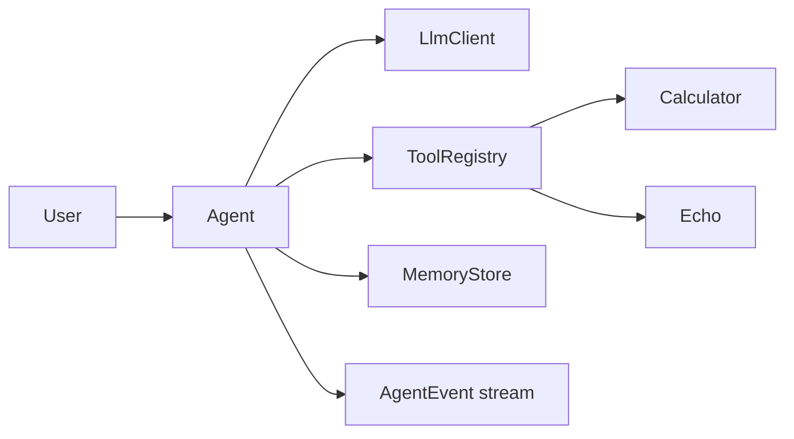

# agent-runtime

A small, typed **tool-calling LLM agent runtime** — streaming events, pluggable memory, and structured tools.

Built as a portfolio project for Senior SWE / AI-agent / AI-platform roles: the kind of core you’d embed inside a product agent, not a chat demo wrapper.

## Why this exists

Most “agent” samples hide the loop. This repo makes the loop explicit:

1. Model proposes text and/or tool calls
2. Runtime validates + executes tools
3. Results are appended to context
4. Repeat until a final answer (or max turns)

That separation is what you need for observability, evals, and safe tool policy later.

## Architecture



| Piece | Role |
| --- | --- |
| `Agent` | Turn loop, tool dispatch, event stream |
| `LlmClient` | Model adapter (`MockLlmClient` + OpenAI-compatible stub) |
| `MemoryStore` | Conversation persistence (in-memory or JSON file) |
| `ToolRegistry` | Named tools with typed parameters |

## Quickstart

```bash
npm install
npm test
npm run example
```

No API key required for tests or the example — they use `MockLlmClient`.

```ts
import { Agent, MockLlmClient } from "@aadiaiagent/agent-runtime";

const agent = new Agent(new MockLlmClient());
const final = await agent.run("Please add 21 + 21");
console.log(final.content); // includes 42
```

Stream events for UIs / logs:

```ts
for await (const event of agent.stream("add 3 + 4")) {
  console.log(event.type, event);
}
```

## Design choices

- **Strict TypeScript** — events and tool I/O are typed, not stringly.
- **Mock-first** — CI and demos run without vendor keys.
- **Safe calculator** — expression parser, not `eval`.
- **OpenAI-compatible escape hatch** — swap in a real model when you have a key.
- **Tiny surface area** — easy to read in a hiring screen share.

## Project layout

```
src/agent/       Agent loop + types
src/llm/         Model clients
src/memory/      Memory stores
src/tools/       Calculator, echo, registry
src/streaming/   Event helpers
examples/        Runnable demo
tests/           Vitest coverage
.github/workflows/ci.yml
```

## Roadmap

- [ ] Tool allowlists / permission prompts
- [ ] Parallel tool calls
- [ ] Token usage + tracing hooks
- [ ] Golden-path eval harness

## License

MIT
